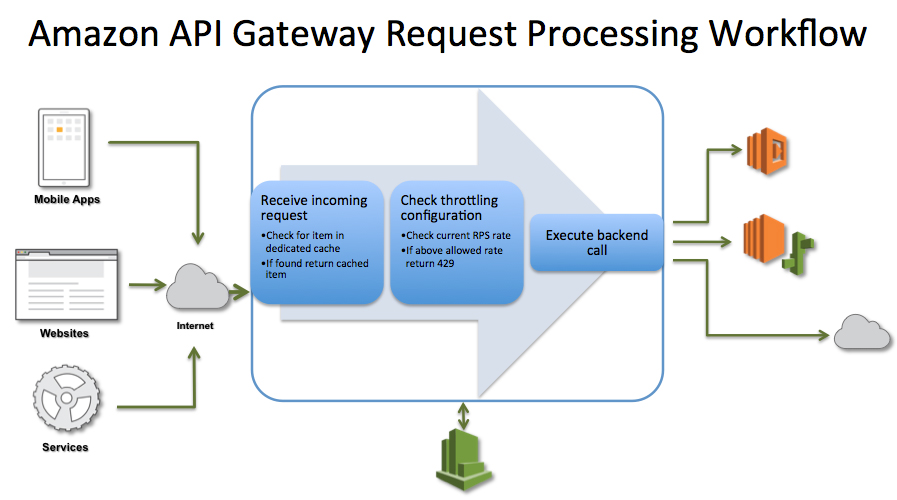

# 03-April-2022- 16th class reading notes:

## AWS: Cloud ServersAWS: API, Dynamo and Lambda:

### **Amazon API Gateway**

Amazon API Gateway: is a managed service that allows developers to define the HTTP endpoints of a REST API or a WebSocket API and connect those endpoints with the corresponding backend business logic. It also handles authentication, access control, monitoring, and tracing of API requests.

Many Serverless applications use Amazon API Gateway, which conveniently replaces the API servers with a managed serverless solution.

**How does API Gateway work?**
API Gateway sits between the backend services of your API and your API’s users, handling the HTTP requests to your API endpoints and routing them to the correct backends. It provides a set of tools that help you manage your API definitions and the mappings between endpoints and their respective backend services. It can also generate API references from your definitions and make them available to your users as API documentation.

**How does API Gateway integrate with other AWS services?**
Many AWS services support integration with Amazon API Gateway, including:

- AWS Lambda: run Lambda functions to generate HTTP API responses.
- AWS SNS: publish SNS notifications when an HTTP API endpoint is accessed.
- Amazon Cognito: provide authentication and authorization for your HTTP APIs.
API Gateway supports direct integrations that can be configured in the API Gateway user interface (or via the API Gateway’s own API) for the following actions:

1. Invoking an AWS Lambda function.
2. Invoking another HTTP endpoint, with or without VPC Link.
3. Making an HTTP call against the API of any AWS service that provides an HTTP API.
4. Returning a mock response generated within API Gateway without calling out to other services.

**API Types**

1. RESTful APIs
Build RESTful APIs optimized for serverless workloads and HTTP backends using HTTP APIs. HTTP APIs are the best choice for building APIs that only require API proxy functionality. If your APIs require API proxy functionality and API management features in a single solution, API Gateway also offers REST APIs.

2. WEBSOCKET APIs
Build real-time two-way communication applications, such as chat apps and streaming dashboards, with WebSocket APIs. API Gateway maintains a persistent connection to handle message transfer between your backend service and your clients.

**Benefits**

1. Efficient API development
2. Performance at any scale
3. Cost savings at scale
4. Easy monitoring
5. Flexible security controls
6. RESTful API options

### **Amazon DynamoDB**

DynamoDB is a hosted NoSQL database offered by Amazon Web Services (AWS). It offers:

- reliable performance even as it scales;
a managed experience, so you won't be SSH-ing into servers to upgrade the crypto libraries;
a small, simple API allowing for simple key-value access as well as more advanced query patterns.
DynamoDB is a particularly good fit for the following use cases:

- Applications with large amounts of data and strict latency requirements. As your amount of data scales, JOINs and advanced SQL operations can slow down your queries. With DynamoDB, your queries have predictable latency up to any size, including over 100 TBs!

- Serverless applications using AWS Lambda. AWS Lambda provides auto-scaling, stateless, ephemeral compute in response to event triggers. DynamoDB is accessible via an HTTP API and performs authentication & authorization via IAM roles, making it a perfect fit for building Serverless applications.

- Data sets with simple, known access patterns. If you're generating recommendations and serving them to users, DynamoDB's simple key-value access patterns make it a fast, reliable choice.

**How it works**
Amazon DynamoDB is a fully managed, serverless, key-value NoSQL database designed to run high-performance applications at any scale. DynamoDB offers built-in security, continuous backups, automated multi-Region replication, in-memory caching, and data export tools.

**Use cases**
1. Develop software applications
Build internet-scale applications supporting user-content metadata and caches that require high concurrency and connections for millions of users, and millions of requests per second.

2. Create media metadata stores
Scale throughput and concurrency for media and entertainment workloads such as real-time video streaming and interactive content, and deliver lower latency with multi-Region replication across AWS Regions.

3. Deliver seamless retail experiences
Use design patterns for deploying shopping carts, workflow engines, inventory tracking, and customer profiles. DynamoDB supports high-traffic, extreme-scaled events and can handle millions of queries per second.

4. Scale gaming platforms
Focus on driving innovation with no operational overhead. Build out your game platform with player data, session history, and leaderboards for millions of concurrent users.

[get started](https://dynamoosejs.com/getting_started/Introduction/)