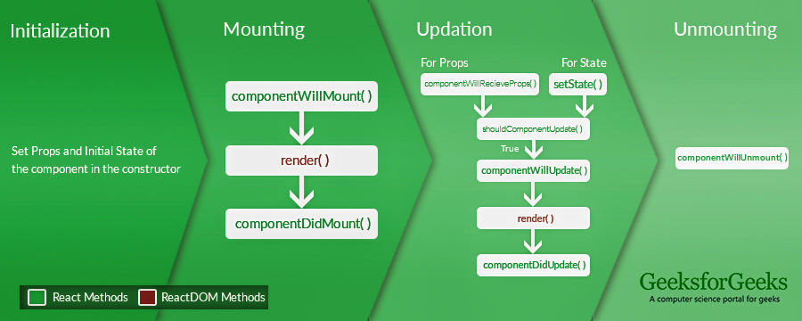

# 28-April-2022- 19th class reading notes:

## Component Lifecycle / useEffect() Hook:

### **WReactJS | Lifecycle of Components**

 lifecycle of a component can be defined as the series of methods that are invoked in different stages of the component’s existence. The definition is pretty straightforward but what do we mean by different stages? A React Component can go through four stages of its life as follows:

 - Initialization: This is the stage where the component is constructed with the given Props and default state. This is done in the constructor of a Component Class.
 - Mounting: Mounting is the stage of rendering the JSX returned by the render method itself.
 - Updating: Updating is the stage when the state of a component is updated and the application is repainted.
 - Unmounting: As the name suggests Unmounting is the final step of the component lifecycle where the component is removed from the page.

### **Using the Effect Hook**

There are two common kinds of side effects in React components:

1. Effects Without Cleanup: Sometimes, we want to run some additional code after React has updated the DOM. Network requests, manual DOM mutations, and logging are common examples of effects that don’t require a cleanup. We say that because we can run them and immediately forget about them. Let’s compare how classes and Hooks let us express such side effects.
   
**What does useEffect do?** By using this Hook, you tell React that your component needs to do something after render. React will remember the function you passed (we’ll refer to it as our “effect”), and call it later after performing the DOM updates. In this effect, we set the document title, but we could also perform data fetching or call some other imperative API.

**Why is useEffect called inside a component?** Placing useEffect inside the component lets us access the count state variable (or any props) right from the effect. We don’t need a special API to read it — it’s already in the function scope. Hooks embrace JavaScript closures and avoid introducing React-specific APIs where JavaScript already provides a solution.

**Does useEffect run after every render?** Yes! By default, it runs both after the first render and after every update. (We will later talk about how to customize this.) Instead of thinking in terms of “mounting” and “updating”, you might find it easier to think that effects happen “after render”. React guarantees the DOM has been updated by the time it runs the effects.

2. Effects with Cleanup: Earlier, we looked at how to express side effects that don’t require any cleanup. However, some effects do. For example, we might want to set up a subscription to some external data source. In that case, it is important to clean up so that we don’t introduce a memory leak! Let’s compare how we can do it with classes and with Hooks.

**Why did we return a function from our effect?** This is the optional cleanup mechanism for effects. Every effect may return a function that cleans up after it. This lets us keep the logic for adding and removing subscriptions close to each other. They’re part of the same effect!

**When exactly does React clean up an effect?** React performs the cleanup when the component unmounts. However, as we learned earlier, effects run for every render and not just once. This is why React also cleans up effects from the previous render before running the effects next time. 

## **Tips for Using Effects**

We’ll continue this page with an in-depth look at some aspects of useEffect that experienced React users will likely be curious about. Don’t feel obligated to dig into them now. You can always come back to this page to learn more details about the Effect Hook.

Tip: Use Multiple Effects to Separate Concerns
One of the problems we outlined in the Motivation for Hooks is that class lifecycle methods often contain unrelated logic, but related logic gets broken up into several methods. 

Note how the logic that sets document.title is split between componentDidMount and componentDidUpdate. The subscription logic is also spread between componentDidMount and componentWillUnmount. And componentDidMount contains code for both tasks.

### **Note**

If you use this optimization, make sure the array includes all values from the component scope (such as props and state) that change over time and that are used by the effect. Otherwise, your code will reference stale values from previous renders. Learn more about how to deal with functions and what to do when the array changes too often.

If you want to run an effect and clean it up only once (on mount and unmount), you can pass an empty array ([]) as a second argument. This tells React that your effect doesn’t depend on any values from props or state, so it never needs to re-run. This isn’t handled as a special case — it follows directly from how the dependencies array always works.

If you pass an empty array ([]), the props and state inside the effect will always have their initial values. While passing [] as the second argument is closer to the familiar componentDidMount and componentWillUnmount mental model, there are usually better solutions to avoid re-running effects too often. Also, don’t forget that React defers running useEffect until after the browser has painted, so doing extra work is less of a problem.

We recommend using the exhaustive-deps rule as part of our eslint-plugin-react-hooks package. It warns when dependencies are specified incorrectly and suggests a fix.

[more hooks-effect](https://reactjs.org/docs/hooks-effect.html)